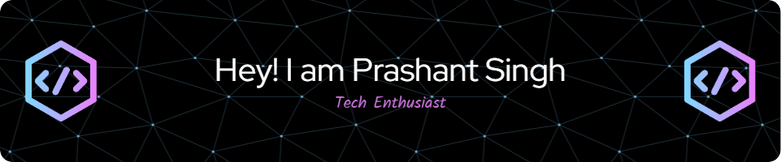

<h2 align="center">
  
</h2>

  
  
  

###

###
<h3 align="center">🛠 Language and tools</h3>

 
  
  
  
  
  
  
  
  
  
  
  
  
  
  
  
  
  
  
          

###

  
   
  
  

###

  

###

 

###
